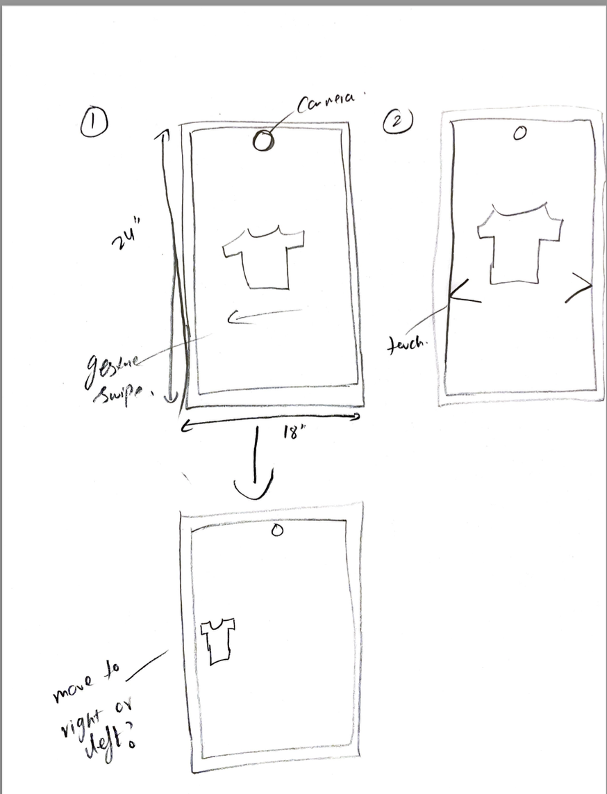
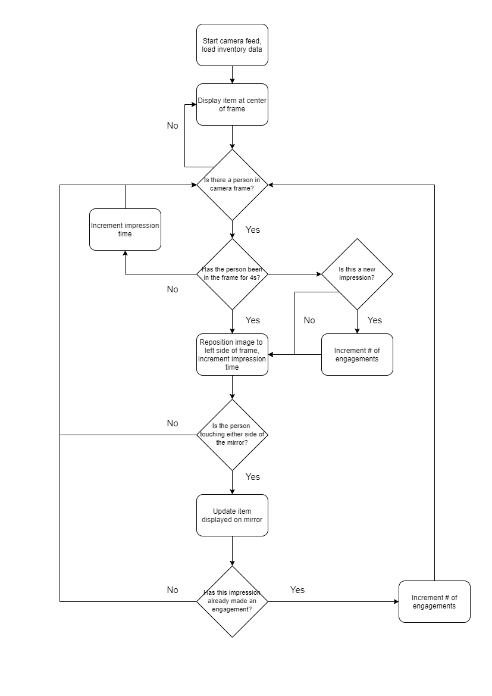

# Final Project

Using the tools and techniques you learned in this class, design, prototype and test an interactive device.

Functional check-off - May 10
 
Final Project Presentations (video watch party) - May 12

## Description
We designed a smart mirror for retail stores to help them liquidate slow running items. Our idea is to innovate ad communication within a traditional touchpoint. Use of digital screens for ads results in ad blindness and failing retention. Our idea is to provide the "pull" factor with mirrors for seamless viewership and increased engagement. 

We designed the smart mirror to enable shop owners use a regular mirror as a marketing channel.In an idle state the mirror displays slow running inventory items in the center of the screen (a), whenever a customer stands in front of the mirror for more than 2 seconds it records that as an impression and moves the item display to the side of the screen (b) to avoid any hinderence in customer's view. Customer still has the option to interact with the mirror and scroll through the displayed items; this is recorded as an engagement. We developed an admin dashboard with the mirror to give the store owner insights on mirror's performance as a marketing channel. The dashboard displays total number of impressions, engagements and average impression time (amount of time customer stands infront of the mirror) for the day. It also displays visualizations of impression and enagagement history for past 7 days. The purpose of the dashboard is to give owner insights into the performance of the  smart mirror and help him figure out the optimal location for the smart mirror in the store. 


## Design Architecture
 ### Design Sketch
 
 
 
 ### Hardware (components used)
 
 #### Server
Our localhost webpage consists of your typical HTML, JS and Python files. The [javascript file](/Final%20Project/static/index.js) waits for events on the webpage and sends a message to a [python](/Final%20Project/app.py) file that serves as a bridge between the server and the pi. Simply put, there are 4 events:
1. Connect: once the webpage is up and running, the pi gets a message that the server is up and running. This triggers the pi to run a [Python script](/Final%20Project/graph.py) that will generate two graphs the describe the mirror's performance in the last 7 days. These are saved in a directory that is specified in the [HTML](/Final%20Project/templates/index.html). The structure of the file containing the performance of the previous has the following format for each row:
```
Date,AverageImpressionTime,#ofImpressions,#ofEngagements
```
2. Start: Once the webpage is up and running there is a 'Start' button at the top of the page that when clicked, sends a message to the pi to [start the "smart" part of the mirror](/Final%20Project/merged.py) (i.e. turn the camera and display on and start measuring impressions and engagements).
3. Impressions: Once the smart mirror is running, the user can click on a button that will fetch the latest performance updates related to impressions. Clicking the 'Refresh Impressions' will show the user a message that looks like: "Average impression time is X.XXs after X impression(s)."
4. Engagements: Similar to the Impressions event, the "Refresh Engagements" button will fetch the latest performance updates related to engagements. Clicking the button will only show the number of engagements.

 
 #### Pi
Once the start command is received from the server, the first thing the pi does is load the items that must be shown on the mirror. To do this, the pi uses the [Item]
/Item.py) class that reads an intenvtory .txt file. This file is structed such that every line is formatted as shown below
```
ProductID,ItemName,Stock,DaysSinceLastSale
```
The latter two values are the determining factors of whether an item needs to be shown in the mirror. Since the mirror is meant to show slow running items, only articles of clothing of which there are 100+ items or have not had a single unit sold in the last 2 weeks will be loaded onto the pi. They are stored as Item objects in a list through which the user can cycle through by interacting with the mirror (more on this later).

Once the items are loaded onto the pi, they are initally displayed front and center of the frame. We used the [Tkinter](https://docs.python.org/3/library/tkinter.html) module to disply the images. The foundation of this code was provided by [HacketHouseYT's Smart-Mirror library](https://github.com/HackerShackOfficial/Smart-Mirror). We modified their demo code to position the images at the center whenever a person is not looking directly at the mirror. If someone was looking at the mirror, either because they were attracted by the image or using the mirror as normal, the displayed image would be repositioned at the left side of the frame as to not hinder the reflection (the mirror's main functionality).

To determine when a person was looking at the mirror, we used a [Teachable Machine](https://teachablemachine.withgoogle.com/) model. The model was trained with 2 classes: "Face" and "Neutral". The former is classified whenever the camera recognizes a face in the camera's frame after 4 seconds. Then, the image would get repositioned. It is important to note that we did not integrate actual face detection into the model. The model was trained with hundreds of picture of a frame with and without a person in sight. Therefore, the details of the model are somewhat of a "black box" made by Google's ML.

Nevertheless, we use this to accurately measure how many people have walked past the mirror or have stopped to use the mirror to any extent. The smart mirror measures 3 metrics in real time: impressions, average time of impressions and engagements. These are defined as follows:
1. Impressions: A person is within the camera's frame for 4s or more
2. Average time of impressions: How long each impression lasts (i.e. how many seconds after the 4s mark) / # of impressions
3. Engagements: Amount of unique impressions which led to a user to physically interact with the mirror (i.e. how many users cycled to some degree throught the items by touching the mirror). This specifically is calculated by checking the values of ports 2 and 9 on the capacitive touch sensors during an impression.

Below is a diagram of how the metrics were measured


_Not described is the calculation of average impression time. This is done at the moment the user on the web page clicks on the "Refresh Engagements" at which point the average calculation is carried out and reported._
 
 ## Demo
4. Finished Product

5. [Technical video](https://drive.google.com/file/d/12rsb5dNeV_98kxRerhpMU2UZF9vAc9TF/view?usp=sharing)
6. [Demo video](https://drive.google.com/file/d/1VQ6X0gf9IwjF8L_LpPwcW_kvp8LJPwKi/view?usp=sharing)
7. Reflection

Looking back we think that using a CV library to detect bodies/faces would have resulted in better measurement performance. As mentioned earlier, we used Teachable Machine and trained the model with pictures and that can result in some unexpected behavior. Using this type of detection would allow us to make more detailed measurements. For example, we could measure the amount of people that walk past the mirror without even looking at it. We could also combine face detection with a Teachable Machine model to analyze the emotion of the user interacting with the mirror (are they surprised, happy, frustrated, etc). Furthermore, we wish we knew how to properly laser cut as we would have liked to make the frame of the window to be made out of wood instead of cardboard. Lastly, we had a set of extra features we wanted to implement but didn't have time to implement them. The major extra feature we couldn't get to was allowing the user to center the diplayed image again with the intention of seeing how the item displayed looks on them (think of a shirt).

7. Contributions
- Anam: camera module and model, created dummy data
- Antonio: server, image display, reading dummy data logic, touch sensor logic
- Both: mirror performance logic, PhUI


## Objective

The goal of this final project is for you to have a fully functioning and well-designed interactive device of your own design.
 
## Description
Your project is to design and build an interactive device to suit a specific application of your choosing. 

## Deliverables

1. Documentation of design process
2. 
3. Archive of all code, design patterns, etc. used in the final design. (As with labs, the standard should be that the documentation would allow you to recreate your project if you woke up with amnesia.)
4. Video of someone using your project (or as safe a version of that as can be managed given social distancing)
5. Reflections on process (What have you learned or wish you knew at the start?)


## Teams

You can and are not required to work in teams. Be clear in documentation who contributed what. The total project contributions should reflect the number of people on the project.

## Examples

[Here is a list of good final projects from previous classes.](https://github.com/FAR-Lab/Developing-and-Designing-Interactive-Devices/wiki/Previous-Final-Projects)
This version of the class is very different, but it may be useful to see these.
